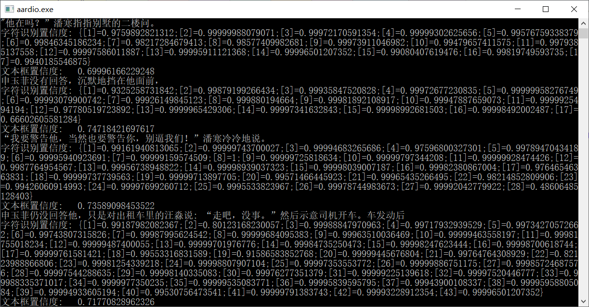

# chineseocrlite-aardio
#### chineseocrlite的aardio支持库

基于[chineseocr_lite](https://github.com/DayBreak-u/chineseocr_lite) 项目，针对aardio特性，制作的dll动态链接库。

所用技术：

1. crnn dbnet
2. onnx
3. opencv

##### 用法：

下载[ocrLite库](https://github.com/xuncv/chineseocrlite-aardio/releases/download/0.0.1/ocrLite.zip)，放到aardio开发环境的lib目录下。

